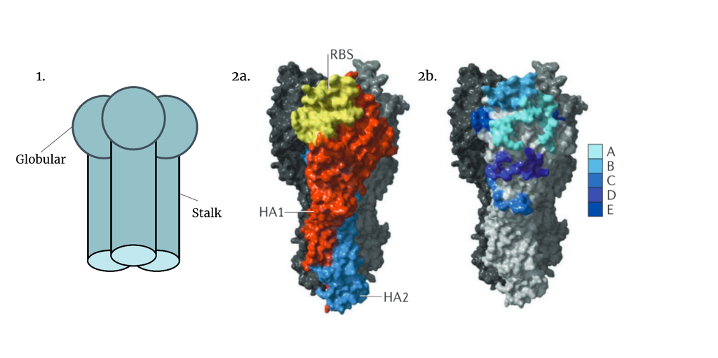
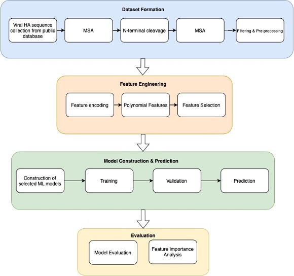
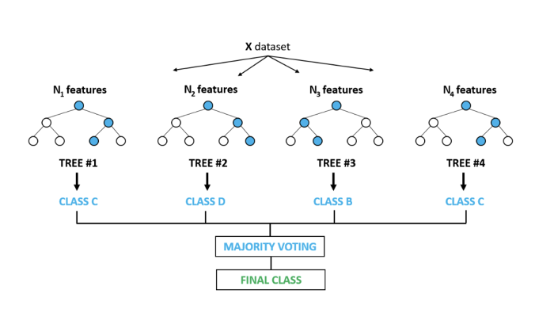
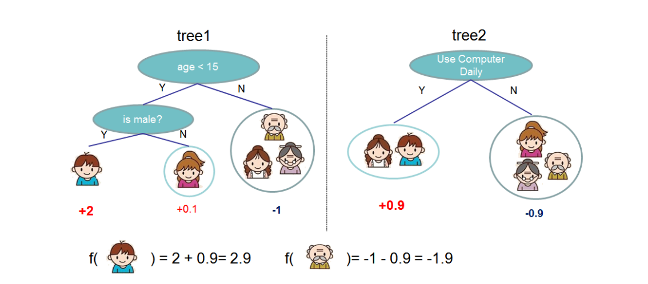
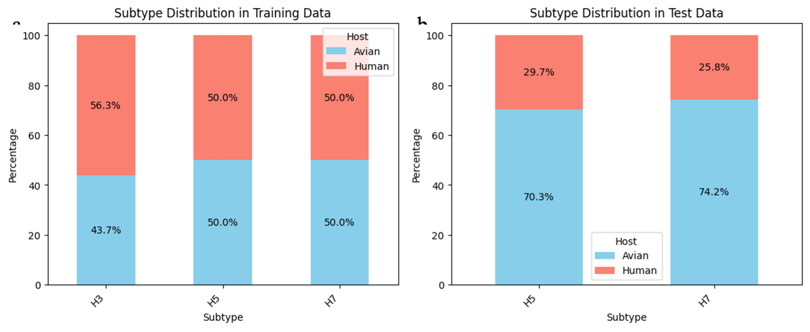
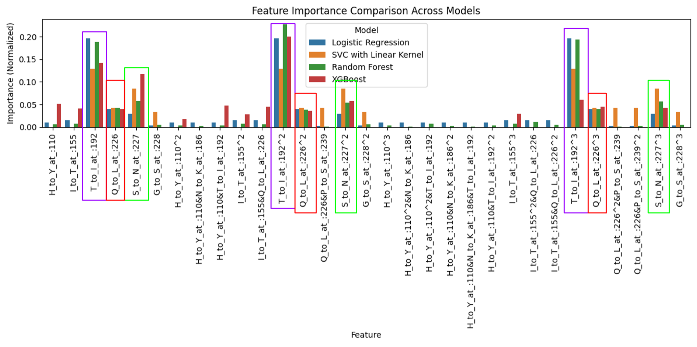

Investigating the Utility of Machine Learning Algorithms in
Glycan-Specificity in Influenza A

Sezen Zeynep Sümer

Supervisor: David Burke

Department/Centre address: King's College London, Guy's Campus

This report has been submitted in part-fulfilment of the requirements
for the MSc in Microbiome in Health and Disease at King's College London

Date of Submission: 30th September, 2024

**Abstract**

Zoonotic viruses pose a significant global threat, as exemplified by
recent pandemics such as the 2009 A/H1N1 influenza and the 2020
SARS-CoV2 pandemic, which collectively caused millions of deaths
worldwide [^1,2^](https://www.zotero.org/google-docs/?awxnCf). To better
prevent and manage future global pandemics, it is crucial to identify
viruses in animal hosts and predict their zoonotic potential. [Among
these threats, avian influenza viruses (AIVs), especially the H5 and H7
subtypes, are of particular concern due to their increasing spread and
associated human fatalities]{.mark}
[^3--7^](https://www.zotero.org/google-docs/?Vqg9dH)[.]{.mark} The
hemagglutinin (HA) protein, central to viral entry by binding to sialic
acid (SA) receptors on host cells, plays a pivotal role in determining
host specificity in the influenza virus
[^8--12^](https://www.zotero.org/google-docs/?HYb8R4). Insights gained
from the well-characterised H3 subtype, which has caused infections in
both avian and human hosts, may enhance our understanding of the binding
capabilities of subtypes with potential pandemic risks, such as the H5
and H7 subtypes. Machine learning (ML) algorithms, which have
demonstrated significant promise in predicting ligand-protein
interactions, offer a powerful tool for assessing zoonotic potential
[^13--19^](https://www.zotero.org/google-docs/?YHzmUr). This research
aims to assess selected ML methods for predicting glycan specificity in
avian influenza and decode feature importance, utilising publicly
available viral sequence data. The goal is to enhance predictive
accuracy, contributing to the early identification and mitigation of
potential zoonotic threats, and thereby strengthening global
preparedness against emerging viral pandemics.

**1. Introduction**

*1.1 Background*

Zoonoses, which are diseases transmitted from vertebrate animals to
humans, account for 75% of all emerging infectious diseases
[^20--22^](https://www.zotero.org/google-docs/?cCCNLC). Among zoonotic
diseases, avian influenza poses a significant emerging threat due to its
ability to cross species barriers and potentially cause pandemics.
Historical pandemics, including the Spanish, Asian, Hong Kong, and Swine
flu, were all caused by different subtypes of the influenza A virus
(IAV). Influenza A viruses are classified based on their two surface
proteins, hemagglutinin (HA) and neuraminidase (NA), of which 16 HA and
9 NA subtypes have been identified across various avian species
[^23,24^](https://www.zotero.org/google-docs/?fnNPCM). Wild birds and
waterfowl are natural reservoirs for nearly all IAV subtypes, and these
viruses occasionally spill over to other species, including pigs,
humans, and other mammals, leading to potential outbreaks and sustained
transmission. For example, the 1957--1958 Asian flu pandemic, caused by
the H2N2 subtype, is believed to have originated from an avian host.
Similarly, the 1968 Hong Kong flu pandemic was triggered by the H3N2
subtype, which emerged as a descendant of H2N2, also having avian
origins. These pandemics resulted in estimated fatalities of 1.1 million
and 1 million people, respectively
[^25--28^](https://www.zotero.org/google-docs/?RgzAPq).

Among these subtypes, the H3 subtype has established itself in both
human and avian hosts through distinct evolutionary pathways. In humans,
the H3N2 subtype emerged during the 1968 Hong Kong flu pandemic and has
since circulated as a seasonal influenza strain, undergoing frequent
antigenic drift to evade immune responses
[^24,28--31^](https://www.zotero.org/google-docs/?yZ1t8P). This makes it
a persistent cause of seasonal flu epidemics. The genetic flexibility
and reassortment of H3 strains across species enable the subtype to
maintain its presence in both human and avian reservoirs, posing an
ongoing zoonotic risk.

In contrast to the established H3 subtype, highly pathogenic H5 and H7
subtypes present a more recent and pressing global health challenge.
These subtypes have caused severe outbreaks in poultry and sporadic
human infections, raising alarms due to their high mortality
rates---exceeding 50% in some
cases[^7^](https://www.zotero.org/google-docs/?zZcPFU). Although
primarily avian in nature, H5 and H7 have demonstrated the ability to
cross into humans, sparking concerns about their potential to adapt for
efficient human-to-human transmission. These strains, especially H5N1
and H7N9, are closely monitored due to their potential to mutate and
cause widespread human transmission. From January 2003 to July 2024, H5
has resulted in 1,237 human cases including 678 deaths, while H7 has
caused 1,680 cases including 617 deaths, with mortality rates of 54.8%
and 36.7% [^7,32--36^](https://www.zotero.org/google-docs/?JkJ0iY).

Current surveillance data indicate that human infections primarily occur
through direct contact with infected poultry or contaminated
environments, with human-to-human transmission being extremely rare
[^7,24,32,37^](https://www.zotero.org/google-docs/?RbBYcE). To prevent
the possibility of these viruses acquiring the capability for sustained
human-to-human transmission, it is crucial to understand the underlying
mechanisms that drive spillover infections.

*1.2 Host Specificity and Mutations in the HA Protein*

The surface protein hemagglutinin has been previously identified as a
crucial determinant of host specificity and plays a fundamental role in
the virus life cycle by binding to the SA receptors on host cell
surfaces, initiating the infection process
[^12,38,39^](https://www.zotero.org/google-docs/?BKhG84). Initially
synthesised as a precursor, HA0, this protein consists of two subunits:
HA1, which contains the receptor binding domain, and HA2, which holds
the fusion peptide (Figure 1). These subunits are linked by disulphide
bonds [^39^](https://www.zotero.org/google-docs/?1p3YTO). Upon cleavage
by host proteases, HA0 matures into the functional HA1-HA2 complex,
forming two distinct domains: the stalk domain, primarily composed of
HA2 with some HA1 residues, and the globular domain, or \"head,\"
primarily composed of HA1, which contains the SA binding pocket
necessary for viral attachment, known as the receptor binding site (RBS)
[^31,40,41^](https://www.zotero.org/google-docs/?hAiy1H).

Mutations in the region near the RBS can significantly impact host
specificity, as observed in the structural and amino acid differences
between human- and avian-adapted strains
[^8--10,42^](https://www.zotero.org/google-docs/?uO9nI3). In
avian-adapted strains, HA recognizes and binds to α(2,3)-linked SAs,
primarily found in the epithelial cells of the avian intestine. In
contrast, human-adapted strains recognize α(2,6)-linked SAs, which are
located in the upper respiratory tract of humans. These mutations that
influence host specificity arise from two key processes: antigenic shift
and antigenic drift.

Antigenic shift refers to abrupt, major changes in the viral genome,
often resulting in a \"species jump\" through gene reassortment, as
observed in the 2009 H1N1 swine flu pandemic
[^43,44^](https://www.zotero.org/google-docs/?cjWOgZ). Antigenic drift
refers to an accumulation of gradual changes, resulting from direct
infection followed by adaptation. Over time, natural selection favours
mutations that enhance compatibility with the host species, as is
commonly seen with avian viruses adapting to humans and contributing to
seasonal flu epidemics
[^31,44^](https://www.zotero.org/google-docs/?jI1wh6).

While antigenic shift is responsible for enabling influenza viruses to
cross species barriers, antigenic drift is crucial for sustaining
efficient human-to-human transmission. This process is driven by the
error-prone nature of viral polymerase and the selective pressures
within the host environment
[^11,38,45^](https://www.zotero.org/google-docs/?u2H9jV). The continuous
genetic evolution through antigenic drift not only allows the virus to
evade immune defences but also ensures its adaptation to the human
population, ultimately supporting the spread of the virus beyond
isolated spillover events. Therefore, to assess whether avian strains
pose a potential pandemic threat to humans and to develop effective
therapeutic interventions, it is crucial to investigate the mutations
actively occurring in high-risk strains. These mutations hold the key to
understanding the virus\'s ability to adapt and spread within human
populations, and their identification is essential for guiding
preventive measures and treatment
strategies.

Figure 1 \| HA structure of an Influenza A virus. 1) HA is a trimeric
glycoprotein consisting of two domains: globular and stalk. 2a) HA
consists of two domains: HA1 (orange) and HA2 (blue). HA1 primarily
forms the globular head and contains the receptor-binding site (RBS)
(yellow). 2b) The five antigenic sites of H3 HA subtype (A-E).
[^31,40^](https://www.zotero.org/google-docs/?UPE8Jq)

Given the critical role of mutations, particularly those in close
proximity to the RBS, continuous genetic and structural surveillance is
vital. Monitoring these changes not only tracks the evolution of avian
influenza viruses but also provides valuable insights into their
potential for human-to-human transmission and pandemic risk. This makes
the detailed study of amino acid-level mutations in the HA protein
essential for understanding the threat posed by specific avian strains
and for developing preventive measures and treatment strategies.

*1.3 Leveraging Machine Learning in Predicting Glycan-Specificity*

Historically, methods such as structural modelling, molecular docking,
and glycan array assays have been widely used to predict glycan
specificity [^46--51^](https://www.zotero.org/google-docs/?E4NGd2).
These techniques have provided valuable insights into how mutations in
HA influence viral binding to host receptors. However, these methods can
be resource-intensive and less scalable when dealing with large datasets
or rapidly evolving viral strains. Given the complexity of mutations,
particularly near the RBS, traditional methods of genetic and structural
analysis can be time-consuming and limited in scope.

Leveraging machine learning algorithms in this context offers a
promising avenue for enhancing our ability to predict glycan-specificity
in avian influenza viruses. In recent years, machine learning has proven
to be a valuable complement to classical methods for predicting glycan
specificity [^13--19^](https://www.zotero.org/google-docs/?T9bjIu).
Machine learning enables the efficient analysis of large datasets,
offering a scalable and dynamic approach to predicting viral behaviour
with greater precision. Recent advancements in high-throughput
sequencing (HTS) have provided vast viral sequence datasets, which, when
integrated with machine learning models, enhance the detection of
patterns and prediction of glycan interactions
[^52,53^](https://www.zotero.org/google-docs/?mQAJ82). These
HTS-generated datasets are essential in identifying key mutations in
viral glycoproteins, such as HA, improving the understanding of viral
adaptation and zoonotic potential. ML algorithms further enhance this
process by continuously refining their predictions as new data becomes
available, supporting the identification of mutations that may increase
cross-species transmission and aiding in the anticipation of
evolutionary changes that could pose future pandemic risks.

However, it is important to note that different prediction tasks require
distinct algorithms, each designed to address specific facets of the
problem. This diversity is especially pronounced when working with
complex data, such as amino acid mutations in protein sequences, where
different algorithms may vary in their effectiveness. Therefore,
evaluating which machine learning algorithms are most appropriate for
predicting glycan specificity from amino acid sequences of the HA
protein is essential. Selecting the most effective models for this task
can enhance the reliability and relevance of the generated predictions,
ultimately improving the understanding of glycan interactions and their
implications for viral behaviour.

*1.4 Research Focus*

This study hypothesises that machine learning algorithms can predict the
glycan specificity of avian influenza viruses utilising publicly
available viral sequence data, with varying degrees of accuracy. The
aims of this research are two-fold: first, to leverage different machine
learning methods to assess their performance in this prediction task and
identify the most suitable algorithm; and second, to predict viral
adaptations while pinpointing key genetic features that drive binding
preferences by decoding the significance of these genetic features.
Successful outcomes will enhance early detection of viral adaptations,
improve risk assessments for human transmission, and support the
development of targeted interventions for managing zoonotic outbreaks.

**2. Materials & Methods**

This section details the datasets, machine learning algorithms, and
analytical methods employed to predict glycan specificity in the
hemagglutinin protein of the influenza A virus. Glycan specificity is
measured based on amino acid mutations that have been strongly
correlated with enhanced viral binding to α(2,6) glycans, as identified
in prior research
[^42,54--64^](https://www.zotero.org/google-docs/?Vef5HC). To ensure
consistency in analysis, the numbering scheme from Burke and Smith is
utilised across the H3, H5, and H7 subtypes, allowing for effective
comparison of mutations among these subtypes
[^65^](https://www.zotero.org/google-docs/?ZKH8ca) .

The study leverages publicly available viral sequence data and
implements several machine learning techniques using Python in the
Google Colab environment to assess their predictive accuracy. The
following subsections describe the key steps involved, including (1)
dataset formation, (2) feature engineering, (3) model construction &
prediction and (4) evaluation (Figure 2).

Figure 2 \| Schematic representation of the machine learning pipeline
used in this study.

*2.1 Dataset Formation*

In this section, key Python libraries such as NumPy, Pandas, and
BioPython were used for numerical operations, data handling, and
biological sequence processing, respectively. These libraries were
central to the analyses performed in this part of the study.

*2.1.1 Sequence collection from public database*

Data from the 1900s onwards was sourced from GISAID\'s EpiFlu database
(Figure 3), focusing on HA protein sequences of the H3, H5, and H7
subtypes. A total of 17,106 initial sequences from both human and avian
hosts were collected in FASTA format for
analysis.

Figure 3 \| GISAID\'s EpiFlu Search & Browse interface displaying the
applied filters for Influenza A H3 HA sequences from human hosts.

*2.1.2 Multiple Sequence Alignment*

Multiple sequence alignment (MSA) is a widely used computational method
for aligning biological sequences, enabling the identification of
conserved regions, evolutionary relationships, and functionally
important motifs across different strains or species
[^66,67^](https://www.zotero.org/google-docs/?vzCPUF). In this project,
MSA is critical for aligning the HA protein sequences of Influenza A H3,
H5, and H7 subtypes from human and avian hosts, facilitating a
comprehensive analysis of sequence variation and subtype-specific
characteristics. Accurate MSA is essential, as any discrepancies in
alignment can lead to erroneous conclusions in subsequent analyses,
undermining the biological relevance of the findings.

For the MSA of these sequences, MUSCLE (Multiple Sequence Comparison by
Log-Expectation) has been chosen as the alignment tool due to its strong
reputation for efficiency and accuracy, especially with large datasets.
This algorithm employs a progressive alignment strategy combined with
iterative refinement steps to enhance the overall quality of the
alignment [^66,68--70^](https://www.zotero.org/google-docs/?okegpX).

For this analysis, separate alignments for H3, H5, and H7 subtypes were
performed, while aligning human and avian strains together within each
subtype. This approach allows for the comparison of intra-subtype
variation between different hosts and captures conserved regions across
hosts, which is essential for understanding host adaptation and
cross-species transmission dynamics.

MUSCLE was configured with the parameters: \'-diags\', and \'-sv\'. The
\'-diags\' option ensures faster alignment by focusing on
high-similarity diagonal regions in the dynamic programming matrix,
which is especially beneficial for closely related sequences
[^71^](https://www.zotero.org/google-docs/?QmilJm). The \'-sv\' option
invokes diagonal optimization with vertical refinement, further
improving the alignment of sequences by refining gaps
[^72^](https://www.zotero.org/google-docs/?7R5NAq). These settings
enable efficient alignment while maintaining high quality for large
datasets.

*2.1.3 N-terminal Cleavage & Realignment (MSA)*

The cleavage of the N-terminal region of the HA protein is essential for
its maturation, which significantly impacts the virus\'s pathogenicity
[^39,40^](https://www.zotero.org/google-docs/?SGDwRU). This maturation
step is also crucial for establishing a standardised numbering scheme,
as proposed by Burke and Smith (2014), ensuring consistent application
across various H subtypes.

To facilitate this process, SignalP 5.0 was employed to predict the
cleavage site of signal peptides, enabling the precise removal of the
N-terminal regions from the aligned sequences of H3, H5, and H7. This
ensures consistency in the numbering schemes across these
subtypes[^73^](https://www.zotero.org/google-docs/?dTwu2y). After this
removal, the sequences were realigned using the same parameters from the
initial MSA to preserve the integrity of the alignment process. This
realignment was essential to accommodate any positional changes that
might have occurred during the trimming process, ensuring that
subsequent analyses, including conserved region identification and
mutation comparison, remain biologically relevant and accurate across
subtypes.

*2.1.4 Filtering & Pre-processing*

Incomplete sequences and identical sequences, identified on a subtype
and host basis, were removed to minimise noise in the dataset and ensure
data integrity. This allowed for a more accurate analysis by reducing
redundancies. The aligned sequences were stored alongside relevant
metadata, including host, sequence, year, and subtype information,
ensuring that each sequence could be traced back to its specific
biological and temporal context.

*2.2 Feature Engineering*

Feature engineering refers to transforming raw data into a structured
format that improves the performance and predictive accuracy of ML
models during training. This process includes selecting, modifying, or
creating features that effectively capture the underlying patterns
within the data, which is critical for achieving optimal model outcomes
[^74,75^](https://www.zotero.org/google-docs/?MizQ3T).

In this project, the principles of feature engineering have been
directly applied to optimise the analysis of protein sequences.
Specifically, (1) feature encoding has been employed to extract feature
vertices from amino acid sequences, while (2) polynomial features have
been utilised for co-occurrence analysis. Furthermore, (3) feature
selection methods have been implemented to identify a subset of relevant
features, ensuring that only the most informative variables contribute
to the predictive models. The sklearn.preprocessing and
sklearn.feature_selection libraries were used to accomplish these tasks.

*2.2.1 Feature Encoding*

In this study, mutations located in close proximity to the RBS of the
hemagglutinin protein were selected as key features, using the numbering
scheme established by Burke and Smith (2014) to ensure consistent
identification across subtypes. These selected mutations, defined by
their original and mutated amino acids along with specific index
information (Table 1), were crucial for understanding their correlation
with phenotypic changes such as loss of N-glycosylation, increased
stability, and increased binding to α(2,6) glycans
[^65^](https://www.zotero.org/google-docs/?Pes2Gp).

  -------------- ------------- ------------ ------------ ------------ -------------------------------------------------------------
   **Original**   **Mutated**  **H3 Index** **H5 Index** **H7 Index**                        **References**

        H              Y           110          103          100        [^58,62,76^](https://www.zotero.org/google-docs/?fhNHV1)

        S              N           126          121          116           [^61^](https://www.zotero.org/google-docs/?ysim4O)

        S              P           128          123          118           [^63^](https://www.zotero.org/google-docs/?duKpgH)

        S              A           137          133          127           [^64^](https://www.zotero.org/google-docs/?jFWZdO)

        A              V           138          134          128           [^59^](https://www.zotero.org/google-docs/?T7mN3g)

        G              R           143          139          132           [^63^](https://www.zotero.org/google-docs/?4eOQdE)

        I              T           155          151          144        [^54,62,77^](https://www.zotero.org/google-docs/?8vI45o)

        N              D           158          154          147           [^58^](https://www.zotero.org/google-docs/?k4hgcg)

        T              A           160          156          151           [^58^](https://www.zotero.org/google-docs/?ffxG5E)

        N              K           186          182          177        [^56,63,78^](https://www.zotero.org/google-docs/?xNIBCy)

        D              G           187          183          178           [^55^](https://www.zotero.org/google-docs/?MiUHF1)

        E              G           190          186          181          [^55,78^](https://www.zotero.org/google-docs/?EUiYvO)

        T              I           192          188          183           [^64^](https://www.zotero.org/google-docs/?e0kT8c)

        K              R           193          189          184           [^61^](https://www.zotero.org/google-docs/?ouyuAT)

        Q           R or H         196          192          187          [^55,63^](https://www.zotero.org/google-docs/?QLpKH9)

        V              I           214          210          205           [^62^](https://www.zotero.org/google-docs/?0YCHKs)

        Q              L           226          222          217       [^42,56,78,79^](https://www.zotero.org/google-docs/?YQoJVl)

        S              N           227          223          218         [^55--57^](https://www.zotero.org/google-docs/?9sydDE)

        G              S           228          224          219       [^42,56,60,63^](https://www.zotero.org/google-docs/?x7KXVE)

        P              S           239          235          230           [^62^](https://www.zotero.org/google-docs/?gCcIta)
  -------------- ------------- ------------ ------------ ------------ -------------------------------------------------------------

Table 1 \| Selected Mutations in Proximity to the Receptor-Binding Site
(RBS) Based on the Burke & Smith Numbering
Scheme[^65^](https://www.zotero.org/google-docs/?gPxz3H)

To transform this mutation data into a ML compatible format, multiple
hot encoding was applied, marking the presence or absence of mutations
at the specified positions. This encoding process converted the raw
sequence data into feature vectors, which were then utilised in machine
learning models to analyse their influence on viral characteristics. By
employing this strategy, the study aimed to draw deeper insights into
the mutations\' roles in altering viral specificity, particularly in
relation to RBS functionality.

*2.2.2 Polynomial Features*

Identifying co-occurring mutations in proteins is crucial for
understanding their combined effects on protein structure, function, and
evolutionary dynamics. These co-occurring mutations can reveal
synergistic interactions that impact how proteins fold, interact with
other molecules, or evade immune responses, particularly in viral
proteins like influenza HA
[^80,81^](https://www.zotero.org/google-docs/?HkW9Nq). In viral
evolution, such mutations may promote immune escape, altered
pathogenicity, or enhanced receptor binding, cumulatively enhancing
antigenic drift [^82^](https://www.zotero.org/google-docs/?f4N2Yg).
Since mutations rarely act in isolation, understanding their collective
impact through co-occurrence analysis is essential for tracking
evolutionary changes and informing strategic interventions. This is
especially important in cases of synergy, where the combined effect of
two mutations in a double mutant exceeds what would be expected from
their individual contributions alone
[^80,83^](https://www.zotero.org/google-docs/?wIK9ef).

Given the importance of these combined effects, understanding
co-occurring mutations in the HA protein is vital for unravelling the
dynamics behind glycan specificity, a critical factor in viral
attachment and host infection. In this study, polynomial features were
employed to incorporate the co-occurrence of mutations into predictive
models, improving the ability to monitor how these mutations influence
glycan binding and, ultimately, viral evolution.

The sklearn.preprocessing library was used to capture complex,
non-linear interactions between features. A polynomial degree of 3 was
chosen to model cubic interactions, enabling the model to account for
interactions among three variables at a time. This choice represents a
tradeoff, balancing the modelling of higher-order interactions while
minimising the risk of an excessively large feature space and
diminishing returns.

*2.2.3 Feature Selection*

Feature selection was performed to reduce overfitting, particularly with
polynomial features of degree 3, and to retain only the most relevant
features for the model. This process also enabled the exploration of
more complex interactions without being overwhelmed by irrelevant
features. To achieve this, sklearn.feature_selection's SelectFpr
function was applied, using the f_classif scoring function. The
SelectFpr method performs univariate feature selection based on p-values
derived from an ANOVA F-test, allowing for the retention of features
that are most statistically
significant[^84^](https://www.zotero.org/google-docs/?wPVm3W). An alpha
value of 0.05 was used as the threshold, meaning features with a p-value
less than 0.05 were kept for further analysis. This approach ensured a
balance between reducing the feature space and preserving meaningful
interactions, optimising model performance while maintaining
interpretability.

*2.3 Model Construction and Prediction*

The classification task aimed to predict glycan specificity of HA
protein sequences, where the features consisted of encoded amino acid
sequences, and the labels indicated glycan binding (0 for avian binding
and 1 for human binding). The objective was to determine which model
would best predict glycan specificity based on known mutations in HA, as
well as to identify the most significant features contributing to the
prediction.

The selected models were trained and validated using GridSearch to
identify the best estimator for each model, based on a range of relevant
hyperparameters [^85--87^](https://www.zotero.org/google-docs/?NP1C7t).
GridSearch performs training and validation simultaneously by
partitioning the training set into multiple subsets, allowing for
cross-validation [^88^](https://www.zotero.org/google-docs/?Zu8iOt).
This approach ensures that each model is evaluated on different portions
of the data, removing the need for a separate validation set. The
training data consisted of the H3, H5 and H7 dataset, while the
remaining sequences from the H5 and H7 datasets were reserved as the
test set for final model evaluation.

The classification models tested, in order of increasing complexity,
were (1) Logistic Regression, (2) Support Vector Classifier (SVC) with a
Linear Kernel, (3) Random Forest, and (4) XGBoost.

*2.3.1 Construction of Selected Models*

*2.3.1.1 Logistic Regression*

Logistic regression predicts the probability of a binary outcome (e.g.,
human vs. avian binding) based on one or more predictor variables (e.g.,
mutations in amino acid sequences). It models the log-odds of the
outcome as a linear combination of the variables, expressed as:

$Logit(P)\  = \ {log\ \left( \frac{P}{1\  - \ P} \right) = \beta}_{0} + \beta_{1}X_{1} + \beta_{2}X_{2} + .\ .\ . + \ \beta_{n}X_{n}$
(1)

where $P$ is the probability of the outcome, $X_{1}$, $X_{2}$, ... ,
$X_{n}$ ​ are the predictor variables, and $\beta_{0}$, $\beta_{1}$, ...
, $\beta_{n}$ ​ are the corresponding coefficients. The logistic function
then converts the log-odds into probabilities for class prediction:

$P(Y\  = \ 1\ |\ X)\  = \ \frac{1}{1\  + \ e^{- (\beta_{0} + \beta_{1}X_{1} + \beta_{2}X_{2} + .\ .\ . + \ \beta_{n}X_{n})}}$
(2)

This formulation allows for the identification of the most important
mutations driving the outcome, making logistic regression useful for
binary classification tasks in biological
data[^89,90^](https://www.zotero.org/google-docs/?lOuYzc).

In this study, logistic regression is used to predict glycan specificity
of amino acid sequences. The model was implemented using scikit-learn\'s
LogisticRegression. The model was fine-tuned using key hyperparameters
for logistic regression, including regularisation strength (C), penalty
function, and optimization solver, to enhance its ability to predict
glycan specificity based on
mutations[^84^](https://www.zotero.org/google-docs/?J0gCCZ).

*2.3.1.2 SVC with Linear Kernel*

SVC (Support Vector Classification) is a specific implementation of the
broader Support Vector Machine (SVM) algorithm, designed for binary
classification tasks. When using SVC with a linear kernel, the model
aims to find the optimal hyperplane that maximises the margin between
the two classes (e.g., human vs. avian glycan
specificity)[^91--93^](https://www.zotero.org/google-docs/?hfvmaq). The
equation of the hyperplane in n-dimensional space is given by:

$w\  \cdot \ x\  + \ b\  = \ 0$ (3)

where $w$ is the weight vector that defines the direction of the
hyperplane, $\ x$ is the input feature vector, and $\ b$ is the bias
term that adjusts the hyperplane position. The optimal hyperplane lies
in the middle of this margin, ensuring the best possible class
separation. The margin γ can be defined as:

$\gamma\  = \ \frac{2}{||w||}$ (4)

This margin is maximised by minimising the objective function:

$\min\frac{1}{2}\ \left| |w| \right|^{2}\ $ subject to
$y_{i}(w\  \cdot \ x_{i} + b)\  \geq \ 1$ (5)

where $y_{i}$ is the label of the data point $x_{i}$ (either +1 or -1
for the two
classes)[^91--93^](https://www.zotero.org/google-docs/?yRLd4q) (see
Figure 4).

Figure 4 \| Class separation in SVC with a linear kernel
[^92^](https://www.zotero.org/google-docs/?XrEdcp)

The SVC model was applied in this study to classify glycan specificity
from encoded amino acid sequences, computing a linear separation between
human and avian classes. The SVC function from sklearn.svm was
implemented with a linear kernel with a class weight balancer to address
potential class imbalance. Key parameters such as the C parameter , tol
(tolerance for stopping criteria) were tuned to improve regularisation
and convergence, enhancing accuracy and generalisation in glycan
specificity prediction.

*2.3.1.3 Random Forest*

Random Forest is an ensemble learning algorithm that combines multiple
de-correlated decision trees to improve prediction accuracy. Each tree
is trained on a randomly sampled subset of the data, helping the model
avoid overfitting and handle both quantitative and qualitative input
variables. This approach is particularly effective for large datasets
and can manage redundant or highly correlated features, leading to
robust classification results
[^94,95^](https://www.zotero.org/google-docs/?hBmoM4).

Random Forest efficiently handles high-dimensionality by building
multiple decision trees that capture interactions between features
(Figure 5). This reduces the risk of overfitting while improving
generalisation, making it ideal for predicting glycan binding based on
encoded mutation data. In Random Forest, multiple decision trees are
constructed through a process called bagging, where each tree classifies
an input $x\ $into a class $C$ based on the majority vote:

$\ ŷ\  = \ mode(\{ T_{1}(x),T_{2}(x),\ .\ .\ .\ ,\ T_{n}(x)\})\ $ (6)

where $T_{1}(x),T_{2}(x),\ .\ .\ .\ ,\ T_{n}(x)$ represent the
predictions made by each individual tree. The mode function finds the
most frequent value (class) among the predictions made by the individual
trees $T_{1}$, $T_{2}$, . . . , ​ $T_{n}$ . The class that appears most
often is considered the final prediction
($\ ŷ$)[^96^](https://www.zotero.org/google-docs/?0bmIIz).

The Random Forest model was employed in this study to predict glycan
specificity based on encoded mutation data, leveraging its ability to
handle high-dimensionality through ensemble learning. The
RandomForestClassifier from sklearn.ensemble was used, with key
hyperparameters such as the number of estimators (trees), maximum depth
of each tree, the minimum number of samples required to split an
internal node, and the minimum number of samples required to be at a
leaf node being fine-tuned to balance model complexity and overfitting.

Figure 5 \| Visualisation of the random forest
algorithm[^94^](https://www.zotero.org/google-docs/?nqeWse)

*2.3.1.4 XGBoost*

XGBoost (Extreme Gradient Boosting) is a scalable ML algorithm based on
tree boosting, which integrates multiple decision trees to improve
prediction accuracy. It uses second-order Taylor expansion for
optimization and is known for handling large datasets efficiently
through parallel computing.

XGBoost employs a series of decision trees for prediction, where each
tree contributes to refining the overall model output. The prediction
for an instance is represented as the sum of the outputs from all trees,
expressed mathematically as:

$\ ŷ\  = \ \sum_{k\  = \ 1}^{K}{}f_{k}(x)$ (7)

where $\ ŷ$ ​is the predicted value, $K$ is the number of trees, and
$f_{k}(x)$ is the output of the $k$-th tree for the input features
$x$[^97^](https://www.zotero.org/google-docs/?qDWxfq).

Figure 6 \| XGBoost tree ensemble
model.[^97^](https://www.zotero.org/google-docs/?7cSuSJ)

XGBoost prevents overfitting by incorporating regularisation techniques
and shrinkage, making it well-suited for binary classification tasks.
When applied to complex data such as multiple one-hot encoded amino acid
sequences for predicting glycan specificity, XGBoost\'s ability to
handle large, high-dimensional datasets and complex feature interactions
ensures robust performance
[^97,98^](https://www.zotero.org/google-docs/?X3vF4L).

In this project, the XGBClassifier from the xgboost library is used with
a grid detailing key hyperparameters such as the number of estimators,
tree depth, learning rate, minimum loss reduction needed for splits
(gamma) and booster.

*2.3.2 Training & Validation*

The training and validation process uses GridSearchCV from
sklearn.model_selection with a 5-fold cross-validation approach.
GridSearchCV searches the hyperparameter grid to find the best
hyperparameter combination, optimising the weighted F1 score to balance
precision and recall. This ensures the best estimator is selected for
the classification task, leading to a more reliable model.

*2.3.3 Prediction*

In the prediction stage, once the best estimator was selected through
GridSearchCV using 5-fold cross-validation, predictions were made on the
test set, which consisted of H5 and H7 data. These test sets were
distinct from the training set, allowing for an unbiased evaluation of
the model's performance on unseen data. The results of the predictions
were evaluated using the methods outlined in section 2.4, ensuring a
comprehensive assessment of accuracy, precision, recall, and other
relevant metrics for the binary classification task.

*2.4 Evaluation*

Evaluating ML models is a crucial step to ensure their robustness and
suitability for specific tasks. Common evaluation methods include
validation, classification report, and feature importance analysis.

Validation analysis involves analysing techniques such as
cross-validation, which helps in assessing how the results of a
statistical analysis will generalise to an independent dataset. This
method splits the data into several subsets, or folds, where the model
is trained on a portion of the data and tested on the remaining subset.
By averaging the performance metrics across all folds, validation
analysis provides a more reliable estimate of the model's predictive
performance and helps mitigate issues related to overfitting.

The classification report provides insights into precision, recall, and
F1-scores for each class, giving a detailed view of a model's
performance, based on four fundamental outcomes: true positives (TP),
true negatives (TN), false positives (FP), and false negatives (FN).
These metrics collectively offer a comprehensive evaluation of the
model\'s effectiveness in classifying the positive and negative classes,
ensuring a deeper understanding of its strengths and weaknesses.

Feature importance analysis, on the other hand, aims to identify which
features significantly influence the model\'s predictions. Techniques
such as permutation importance or tree-based methods (like those used in
Random Forest and XGBoost) rank features based on their contribution to
the model\'s accuracy. Understanding feature importance is essential for
interpreting the model and can guide further feature selection, ensuring
that the model relies on the most relevant data, ultimately leading to
improved performance and insights into the underlying processes being
modelled

**3. Results**

*3.1 Model Evaluation*

*3.1.1 Data Overview*

To facilitate a clear understanding of the subsequent analysis and
discussion, it is essential to first examine the dataset itself. The
dataset comprises multi-hot encoded arrays, where each feature is binary
(0 or 1), representing the presence or absence of specific categories
(mutations). These categories capture different attributes or
characteristics relevant to the problem under study, and the target
variable is binary, indicating two possible outcomes (e.g., avian or
human binding). Prior to filtering and preprocessing, the dataset
initially contained 17,106 sequences, but after removing identical and
incomplete sequences, this was reduced to 8,579 sequences.

To evaluate subtypes that have not yet established themselves in human
hosts, 100% of the H3 dataset---an established subtype in both human and
avian hosts---was allocated for training, providing a robust foundation.
In contrast, only 20% of the H5 and H7 datasets were reserved for
training, with the remaining 80% designated for testing. The H3
strain\'s extensive documentation in both human and avian hosts allowed
for a larger number of available sequences compared to the predominantly
avian H5 and H7 strains, which resulted in class imbalance. To mitigate
this imbalance, SMOTE was applied to synthetically increase the
representation of H5 and H7 sequences, with a specific focus on
augmenting human samples. This process ensured a more balanced dataset
for model training. After applying SMOTE, the total number of sequences
increased to 9,964 (see Figure 7). However, a slight imbalance still
persisted in the H3 dataset between human and avian hosts, which will be
taken into account during the following stages of
analysis.

Figure 7 \| Avian and human host ratios of the (a) training and (b)
testing data sets.

*3.1.2 Validation Results*

In this study, GridSearchCV was employed to optimise each model by
identifying the best-performing estimator based on validation results,
prior to testing on unseen data. A 5-fold cross-validation ensured
balanced representation of both avian and human samples in each fold,
minimising bias and providing a robust evaluation of model
performance.[^87,99,100^](https://www.zotero.org/google-docs/?xAcr8o).

The F1-weighted score was selected as the primary metric during this
process, representing a weighted average of the F1 scores for each
class, with weights proportional to the number of true instances
(support). This metric is particularly useful for imbalanced datasets,
as it accounts for performance across both majority and minority
classes, preventing dominance by the majority class.

The formula for calculating the F1 score for each class is:

$F1\  = \ \frac{2\  \times \ Precision\  \times \ Recall\ }{Precision\  + \ Recall}$
(8)

Where precision is the ratio of true positives to the sum of true
positives and false positives (as shown in Equation (9))
[^101--103^](https://www.zotero.org/google-docs/?6SBN0y)

> $Precision\  = \ \frac{TP}{TP\  + \ FP}$ (9)

and recall is the ratio of true positives to the sum of true positives
and false negatives (as shown in Equation (10))
[^101--103^](https://www.zotero.org/google-docs/?qCwnNz)

$Recall\  = \ \frac{TP}{TP\  + \ FN}$ (10)

The F1-weighted score helps evaluate the model\'s performance during
cross-validation, balancing precision and recall across both classes. It
ensures that the model is not biassed toward the majority class,
providing a more accurate assessment of its generalisation ability.
After cross-validation, hyperparameters are selected based on the
configuration yielding the best validation score, which indicates how
well the model generalises to unseen data. A high validation score
suggests effective learning of generalizable patterns, while a
significant drop from training performance may indicate issues like
overfitting or poor generalisation, particularly in imbalanced datasets
[^99,100^](https://www.zotero.org/google-docs/?tmwj3V). By analysing the
validation scores, one can assess the robustness of the model and its
ability to adapt to variations in real-world data.

In Table 2, the best weighted F1-scores for each classification
algorithm are presented. Logistic Regression achieves the highest score
at 0.534, indicating a balanced performance between precision and recall
across classes. Following closely, Random Forest and XGBoost score 0.506
and 0.521, respectively, demonstrating their effectiveness in handling
the classification task, albeit slightly less than Logistic Regression.
SVC with a Linear Kernel has the lowest score at 0.442, suggesting
challenges in generalising unseen data compared to the other models.
These scores provide valuable insights into the relative strengths and
weaknesses of each algorithm for this particular classification problem.

  --------------------------------------- -------------------------------
  **Classification Algorithm**            **Best Weighted F1-Score**

  Logistic Regression                     0.534

  SVC with Linear Kernel                  0.442

  Random Forest                           0.506

  XGBoost                                 0.521
  --------------------------------------- -------------------------------

Table 2 \| Cross Validation Results of Selected ML Methods

*3.1.3 Classification Report*

Analysing the classification report is crucial for understanding the
performance of models in classification tasks. Accuracy, one of the key
metrics reported, is defined as the proportion of true positive and true
negative predictions among the total predictions made. It is calculated
using the formula:

$Accuracy\  = \ \frac{TP\  + \ TN}{TP\  + \ TN\  + \ FP\  + \ FN}$ (11)

When interpreting accuracy, it's important to consider the context of
the dataset, especially in cases of class imbalance, as high accuracy
might be misleading if the model predominantly predicts the majority
class.Table 3 summarises the classification results of all the models
used, illustrating their varying strengths in precision, recall,
F1-score, and accuracy. The classification results highlight the
challenges presented by the imbalance in the dataset, primarily due to
the significantly greater number of avian samples for H5 and H7. This
highlights the importance of choosing a model that can effectively
handle these imbalances while delivering robust predictions. The
ultimate goal is to identify a model that not only performs well overall
but also ensures reliable classification of the minority class.

  ---------------- --------------- -------------- ------------ -------------- -------------- -------------- --------------
   **Classifier**   **Precision**   **Precision    **Recall**     **Recall     **F1-Score**    **F1-Score    **Accuracy**
                                    (Weighted)**                (Weighted)**                  (Weighted)**  

      Logistic       0.726 (0),        0.528       1.000 (0),      0.726        0.842 (0),       0.611          0.726
     Regression      0.000 (1),                    0.000 (1)                    0.000 (1)                   

  SVC with Linear    0.727 (0),        0.802       1.000 (0),      0.728        0.842 (0),       0.614          0.728
       Kernel         1.000 (1)                    0.004 (1)                    0.008 (1)                   

   Random Forest     0.730 (0),        0.804       1.000 (0),      0.731        0.844 (0),       0.622          0.731
                      1.000 (1)                    0.017 (1)                    0.033 (1)                   

      XGBoost        0.711 (0),        0.505       1.000 (0),      0.711        0.831 (0),       0.591          0.711
                      0.000 (1)                    0.000 (1)                    0.000 (1)                   
  ---------------- --------------- -------------- ------------ -------------- -------------- -------------- --------------

Table 3 \| Cross Validation Results of Selected ML Methods

Among the models evaluated, Random Forest stands out as the most
effective for prediction, achieving the highest accuracy (0.731) and
weighted F1 score (0.622) , demonstrating a better balance between
precision and recall compared to its counterparts. It effectively
addresses the challenges associated with the minority class that both
Logistic Regression and XGBoost encounter, as both models exhibit low
recall for class 1, indicating their failure to identify critical
instances of this class. Although the SVC with Linear Kernel achieves
perfect precision for class 1, it struggles to accurately identify the
majority class, as evidenced by its low F1-score. This highlights the
importance of evaluating overall performance across both classes, rather
than solely focusing on precision or recall for one class. Therefore,
while Random Forest leads in accuracy and overall performance, a careful
evaluation of each metric is essential to select a model that
effectively addresses the specific needs of this classification task,
particularly in the context of mitigating the effects of data imbalance
in the test set.

*3.2 Feature Interpretation*

Feature interpretation is essential in understanding how different
variables contribute to model predictions, and in some cases, improving
predictive
performance[^104^](https://www.zotero.org/google-docs/?ZCnaWd). This
process deepens understanding of the domain and supports informed
decision-making. In the context of identifying significant mutations
that influence glycan specificity classification, feature interpretation
helps pinpoint the mutations with the greatest impact on glycan
specificity determination. Each mutation is represented as a feature in
the model, and the magnitude of its coefficient indicates its influence
on the classification outcome.

The approach to feature interpretation varies between linear models and
tree-based models. In linear models, such as Logistic Regression and
Linear SVC, feature weights are directly represented by the model
coefficients. These coefficients ($\beta$) reflect the strength and
direction of the relationship between each feature ($x$) and the target
variable ($y$), enabling straightforward interpretation.

The relationship can be mathematically expressed as:

$y\  = \ \beta_{0} + \ \beta_{1}x_{1} + \ \ \beta_{2}x_{2}\  + \ .\ .\ .\  + \beta_{n}x_{n}$
(12)

When evaluating feature importance in linear models, features should be
ranked based on the absolute values of these coefficients (∣β∣). This
ranking allows for an understanding of the influence of each feature on
the target variable, irrespective of the direction of the relationship.
A larger absolute value indicates a stronger influence on $y$.

In contrast, tree-based models, such as Random Forest and XGBoost, use
metrics like Gini impurity or information gain (based on entropy) to
assess feature importance
[^96,97^](https://www.zotero.org/google-docs/?qLoFFy). These metrics
evaluate how well a feature splits the data into more homogeneous
subsets, assigning importance scores based on the total reduction in
impurity achieved across all trees in the model. A higher importance
score indicates a stronger influence on the model's predictions, but
unlike linear models, these scores do not indicate whether the feature
has a positive or negative impact on the target---only its overall
contribution to improving the model\'s accuracy. Features that lead to
larger decreases in impurity have a more significant impact on the
model's classification performance.

To interpret feature importance effectively across all models, the
absolute value of the linear models\' coefficients is first taken to
focus on their magnitude, as the sign (positive or negative) in linear
models shows the direction of the relationship, not its importance.
Next, all coefficients and feature importance scores are normalised to
compare features across different models. This ensures that each
feature's relative importance is evaluated within its own model,
independent of scale. The normalised importance for each feature
$I_{f_{i}}$ can be calculated using the formula:

$I_{f_{i}}\  = \ \frac{\left| w_{i} \right|}{\sum_{i\  = \ 1}^{n}\left| w_{i} \right|}$
(13)

Where $\left| w_{i} \right|$ is the absolute value of the linear model
coefficient or the raw feature importance from a tree-based model, and
$n$ is the total number of features. This normalisation allows for a
fair comparison across both linear and tree-based models, highlighting
the most impactful features in each.

Figure 7 shows the normalised feature importances across four machine
learning models: Logistic Regression, SVC with Linear Kernel, Random
Forest, and XGBoost, using mature H3 indices. The plot effectively
compares the relative importance of features across these models, with
normalisation ensuring that each feature\'s importance is evaluated
within its own model, independent of scale. This allows for fair
comparison across models despite their different mechanisms for
determining feature importance.

For the linear models (Logistic Regression and SVC with Linear Kernel),
feature coefficients were first converted to absolute values, removing
the sign to focus solely on the magnitude of the feature\'s influence.
This approach ensures that only the strength of the relationship is
considered, not whether it\'s positive or negative. In the tree-based
models (Random Forest and XGBoost), raw feature importance
scores---based on impurity reduction---were used directly.

The features with higher bars in the plot contribute more significantly
to the model\'s performance. Three main mutations---Tto_I_at_192,
S_to_N_at_227, and Q_to_L_at_226---along with their polynomial variants,
stand out as the most influential features across different models.
These mutations significantly impact the predictions, highlighting their
biological relevance and suggesting that they play crucial roles in the
underlying mechanisms being modelled. The variations in their
importance, especially when considering both base and polynomial
features, provide valuable insights into how these mutations may
interact with other factors and influence the overall model
behaviour.

> Figure 8 \| Feature Importance Comparison Across Models

T_to_I_at_192 stands out as a significant feature, with both the base
mutation and its polynomial variants displaying consistently high
importance across the different models. This suggests that the threonine
(T) to isoleucine (I) substitution at position 192 in mature H3 plays a
pivotal role in predicting the outcome. The persistence of importance in
the higher-order features, such as T_to_I_at_192\^2 and other polynomial
variants, implies that this mutation does not solely exhibit a simple
linear relationship with the target variable. Instead, its influence
appears to extend into more complex, non-linear domains, where
interactions between this mutation and other features become relevant.
The higher-degree polynomial terms likely capture these nuanced
interactions or effects that the linear feature alone cannot fully
explain. This could reflect intricate biological mechanisms, such as
structural changes in the protein that are influenced by multiple
factors simultaneously, which lead to non-linear contributions to the
model\'s predictions. Therefore, the importance of these polynomial
terms suggests a deeper, layered impact of the T_to_I_at_192 mutation,
making it a critical feature for the models' performance.

The feature S_to_N_at_227 and its polynomial variants (e.g.,
S_to_N_at_227\^2) also show varying levels of importance across the
models. The base mutation, S_to_N_at_227, represents a point mutation
where serine (S) is replaced by asparagine (N) at position 227 in the
protein sequence. This feature likely has biological significance,
suggesting that changes at this specific position might have notable
effects on the protein\'s structure or function. However, as the
polynomial variants (e.g., S_to_N_at_227\^2) are introduced, their
importance tends to decrease across the models. This decline in
importance suggests that while the base mutation at position 227 is
crucial, the mutation has a more direct, linear effect on the outcome,
with limited non-linear interactions or higher-order contributions.

In addition to T_to_I_at_192 and S_to_N_at_227, the mutation
Q_to_L_at_226 also warrants attention. This mutation involves the
substitution of glutamine (Q) with leucine (L) at position 226 in the
mature H3 protein sequence. The importance of this mutation, as
reflected in the models, indicates that it may play a significant role
in the protein\'s functionality or stability. The Q_to_L_at_226
substitution may affect the protein\'s structure and interactions, as
leucine is a hydrophobic amino acid, whereas glutamine is polar and
capable of forming hydrogen bonds. This change could influence how the
protein folds or interacts with other molecules, potentially altering
its biological activity.

Analysing the polynomial variants of Q_to_L_at_226 reveals that there is
little to no variation in their importance across the models. This
suggests that the impact of this mutation is primarily captured by the
base mutation itself, indicating that complex non-linear interactions
may not significantly influence its contribution. Understanding the
implications of Q_to_L_at_226, alongside T_to_I_at_192 and
S_to_N_at_227, provides a comprehensive view of these mutations\' roles
in the model and their potential effects on the protein\'s function.
This consistency underscores the straightforward relationship between
the Q_to_L_at_226 mutation and the model\'s predictions.

**4.Discussion**

The findings of this study underscore the complexities and challenges of
using machine learning algorithms to predict the glycan specificity of
the HA protein in avian influenza viruses. While we successfully
identified key genetic features and assessed various algorithms, several
limitations arose due to data constraints and resource availability.
This discussion will explore these limitations, highlight key findings
related to model performance and significant mutations, and propose
future research directions to enhance the predictive capabilities and
understanding of viral behaviour.

*4.1 Limitations*

This study faces several limitations primarily related to data
availability and time & resource constraints. First, the scarcity of
human H5 and H7 sequences significantly affects the training and testing
of machine learning models. Despite the application of oversampling
techniques, such as synthetic data generation (SMOTE), the limited
availability of real-world data reduces the models\' reliability, as
synthetic data may not fully capture the complexity and variability
inherent in natural sequences. This directly impacts model performance
and generalizability. Additionally, time and resource constraints played
a role in limiting the depth of this research. The study was conducted
over a span of six months, restricting the exploration of mathematical
and structural analyses that could provide further insights into the
model\'s results. Techniques such as PCA, permutation feature
importance, and correlation analysis were not fully explored.
Experimentation with hyperparameters was also limited due to the
computational intensity of methods such as grid search. The
computational cost of increasing the number of parameters was
prohibitively high and as a result, the models used may not reflect
their optimal configurations, potentially affecting predictive accuracy.

Lastly, the study\'s focus on the sequence of a single gene represents a
reductionist approach, addressing only one element of the virus-host
interaction. It is important to acknowledge that glycan binding is
merely one part of the intricate infection process. Binding alone does
not ensure successful infection, as other factors play critical roles in
determining infection outcomes. Elements such as the host\'s immune
response and viral replication efficiency also influence the overall
infection dynamics. Incorporating these additional variables in future
work would provide a more holistic understanding of the infection
process. Expanding the model to account for a wider range of factors
beyond glycan binding would improve its predictive capabilities and
offer more comprehensive insights into viral behaviour.

*4.2 Key Findings*

*4.2.1 Model Performance*

The evaluation of various classification algorithms revealed distinct
performance characteristics. Logistic Regression attained the highest
weighted F1-score (0.534) when applied to a balanced validation set;
however, it underperformed in classification metrics when assessed on
the imbalanced test data. In contrast, the Random Forest algorithm
demonstrated superior overall performance in classification reports,
exhibiting robust accuracy and F1 scores, which indicate its enhanced
capability to manage the imbalanced nature of the H5 and H7 data.
Although simpler models may excel in identifying feature importance,
ensemble methods such as Random Forest appear to be more effective for
classification tasks, particularly in the context of challenging
datasets.

The observed model performance disparities highlight the influence of an
imbalanced test set. While SMOTE was applied to create balanced training
and validation sets, the imbalanced nature of the test data led to
challenges in accurately classifying instances of the minority class. As
a result, models such as Random Forest, XGBoost, and SVC with a Linear
Kernel performed less effectively on the test set, particularly in
recalling the human-binding class. This situation emphasises that while
SMOTE can enhance validation scores by mitigating class imbalance, the
model\'s performance in real-world scenarios---represented by the test
set---can still be adversely affected by imbalanced distributions.
Therefore, to achieve reliable predictions, it is crucial to consider
the distribution of the test set and tailor model evaluation strategies
accordingly.

The integration of polynomial features, specifically the incorporation
of co-occurrence among mutations, yielded some insightful observations,
albeit not entirely as anticipated. For certain mutations, this approach
elucidated the relationship between individual mutations and glycan
specificity classifications. However, it did not reveal the expected
co-occurrence among multiple distinct mutations. This limitation
suggests that while the polynomial feature integration provided valuable
insights, its potential remains underutilised in the current model
framework. Future enhancements to the model may enable a more effective
exploitation of this polynomial approach, allowing for a deeper
understanding of the intricate relationships among mutations and their
collective impact on glycan specificity.

*4.2.2 Key Mutations*

Through our machine learning pipeline, three key mutations emerged with
the highest feature importance across all selected models: T192I
(T_to_I_at_192), Q226L (Q_to_L_at_226), and S227N (S_to_N_at_227). These
mutations reside in critical loops and helices of the protein, including
the 130 loop, 190 helix, and 220 loop, as well as antigenic regions,
which may significantly impact the overall structure and functional
properties of the
protein[^105^](https://www.zotero.org/google-docs/?sWBGOP). The
molecular properties of the involved amino acids---such as polarity,
hydrophobicity, and hydrogen bonding capabilities---are pivotal in
determining the protein\'s stability and conformation. Alterations in
these regions could lead to changes in glycan specificity by affecting
the binding interactions between the protein and glycans. Understanding
the implications of these mutations on the protein structure, glycan
interactions, and immune recognition is crucial for elucidating their
potential roles in viral pathogenesis and immune evasion.

### *4.2.2.1 T192I (T_to_I_at_192)*

The T192I mutation significantly alters the 130 loop (indices 135-135)
and the 190 helix, both of which are integral to the protein's
structural integrity and functionality. This mutation has been confirmed
in glycan microarray studies, indicating its role in glycan specificity.
The original residue, threonine (T), is uncharged and polar, capable of
forming hydrogen bonds, which is crucial for maintaining interactions
within the protein structure. In contrast, the isoleucine (I) residue is
hydrophobic and nonpolar, lacking hydrogen bond formation capabilities.
This change can disrupt the loop\'s conformation, affecting how the
protein interacts with glycans. Additionally, the T192I mutation is
located in antigenic region B, highlighting its potential impact on
immune recognition and antibody binding, as changes in this region can
influence how effectively the immune system can target the protein.

*4.2.2.2 Q226L (Q_to_L_at_226)*

The Q226L mutation is particularly noteworthy due to its strong
connections to glycan specificity as reported in the
literature[^42,56,78,79,105,106^](https://www.zotero.org/google-docs/?QOTntG).
Positioned within the receptor-binding site, this mutation is crucial
for interactions with glycan ligands. While it has commonly been
observed to co-occur with G228S, this relationship was not captured in
the current model. The substitution from glutamine (Q) to leucine (L)
can significantly affect hydrogen bond formation and van der Waals
interactions between the SA moiety and the
protein[^105^](https://www.zotero.org/google-docs/?05U6my). The
alteration in side-chain properties may modify the binding affinity and
specificity for glycans. Additionally, Q226L resides in the 220 loop, a
region known for allowing viral escape from broadly neutralising
antibodies. Thus, changes in this loop could enhance the virus\'s
ability to evade immune detection, further emphasising the significance
of this mutation.

*4.2.2.3 S227N (S_to_N_at_227)*

The S227N mutation introduces an asparagine (N) residue in place of
serine (S), which can influence the structural dynamics of the
protein[^79^](https://www.zotero.org/google-docs/?CBX6SB). The presence
of the polar, hydrophilic asparagine could affect local interactions
within the protein, potentially altering the conformation of surrounding
loops and helices. Given that this mutation is also situated in the
vicinity of crucial binding sites, any structural changes could impact
the protein\'s glycan specificity and its overall stability. While S227N
may not be as well characterised in the literature as the previous
mutations, its placement in a functional region suggests it could still
play a role in the protein\'s interaction with glycans and its
recognition by antibodies.

In summary, the integration of these mutations into key loops and
helices and their positioning within antigenic sites underscores their
significance in influencing the protein\'s structure, functionality, and
interactions with glycans and the immune system. Understanding these
relationships is vital for elucidating the underlying mechanisms of
glycan specificity.

*4.3 Future Works*

*4.3.1 Exploration of Therapeutic Applications*

The identification of key mutations in the HA protein, particularly
those influencing glycan specificity and antigenic properties, can
significantly enhance vaccination efforts by deepening our understanding
of viral evolution and immune evasion strategies
[^15,61,76^](https://www.zotero.org/google-docs/?Oihlgo). Moreover,
integrating predictive models to assess mutation-driven changes in
antigenicity could refine antigen selection for seasonal vaccines,
ultimately leading to more effective immune responses and reducing the
need for frequent updates. This predictive insight would also facilitate
the preventive development of broadly neutralising vaccines by
identifying conserved regions in HA that are less prone to mutation,
ensuring long-lasting
immunity[^107^](https://www.zotero.org/google-docs/?UVbiI6)*.*

*4.3.2 Improving the Predictive Model*

To enhance the predictive model\'s accuracy and applicability in
understanding HA protein mutations, several advanced deep learning
techniques can be leveraged. Neural networks (NNs) are particularly
effective at capturing the intricate patterns present in biological
data, making them invaluable for predicting the antigenic properties and
binding interactions of viral proteins. Deep neural networks, especially
when integrated with protein language models such as ProtTrans, ESM-2,
and ESM-1b, offer a significant advancement in feature representation.
These models utilise vast datasets of protein sequences to generate
embeddings that encapsulate essential biological features. By leveraging
this rich contextual information, the predictive capabilities of the
model are greatly enhanced, allowing for more accurate forecasts of how
mutations may affect binding and immune recognition.

To refine the model\'s predictive power, it is also beneficial to expand
the classification framework to a three-state classification
system---non-binder, weak binder, and strong binder---based on
biological assays. This nuanced approach allows for better
differentiation among varying levels of binding affinity. For example, a
strong binder may warrant a different vaccine formulation or dosing
strategy than a weak binder. This refined approach ensures that vaccines
are optimised for the specific antigenic properties of the targeted
virus, potentially improving overall effectiveness.

Furthermore, the incorporation of structural information into the
predictive framework can substantially enrich the analysis of binding
sites. For example, examining the three-dimensional structures of the HA
protein (through sources such as the Protein Data Bank) and its
interactions with immune components can provide critical insights into
how specific mutations and spatial arrangements influence binding
affinities. Such insights can lead to the identification of critical
residues that govern interactions, thus refining the model\'s accuracy.

Lastly, applying this enhanced predictive model to other subtypes, such
as H9, not only broadens the scope of the analysis but also helps
generalise findings across different viral strains. Training the model
on diverse datasets allows it to adapt to various antigenic landscapes,
ultimately improving predictive accuracy for emerging strains. This
adaptability is crucial for developing more effective and broadly
applicable vaccination strategies, which can respond proactively to
viral evolution and immune evasion tactics.

*4.4 Conclusion*

This study investigated the utility of machine learning algorithms in
predicting the glycan specificity of the HA protein of the influenza A
virus, hypothesising that varying degrees of accuracy could be achieved
using viral sequence data. We achieved our objectives by employing
various machine learning methods, evaluating their performance, and
identifying the most suitable algorithm for this task. Additionally, we
pinpointed key genetic features that drive binding preferences,
enhancing our understanding of viral adaptations. While this research
provides a foundational understanding, further improvements, as
highlighted in the future works section, could enhance the predictive
capability and applicability of these models.

**Acknowledgements**

I would like to thank my supervisor, David Burke, for their guidance and
support throughout the course of this dissertation. His expertise has
been invaluable to the development of this work.

I would also like to acknowledge the program leads, particularly David
Moyes, for their leadership and the structure they provided to the
Microbiome MSc course. His support has been greatly appreciated.

Finally, I am grateful to my classmates for their collaboration and
shared insights during this journey.

**Supplementary Material**

The code utilised in this study has been included as supplementary
material and is provided as a separate attachment. This supplementary
file contains all relevant scripts and implementations necessary to
reproduce the findings discussed in the main text.

**References**

[1. Number of COVID-19 cases reported to WHO. *WHO COVID-19 dashboard*
https://data.who.int/dashboards/covid19/cases?n=c.
(2024).](https://www.zotero.org/google-docs/?0P7Q1D)

[2. Past pandemics. *World Health Organization*
https://www.who.int/europe/news-room/fact-sheets/item/evaluation-of-the-response-to-pandemic-(h1n1)-2009-in-the-european-region#:\~:text=2009%20pandemic&text=For%20the%20first%20time%2C%20pandemic,in%20the%20first%20year%20alone.
(2010).](https://www.zotero.org/google-docs/?0P7Q1D)

[3. Chen, J. *et al.* Novel Reassortant Avian Influenza A(H5N6) Virus,
China, 2021. *Emerg. Infect. Dis.* **28**, 1703--1707
(2022).](https://www.zotero.org/google-docs/?0P7Q1D)

[4. Focosi, D. & Maggi, F. Avian Influenza Virus A(H5Nx) and Prepandemic
Candidate Vaccines: State of the Art. *Int. J. Mol. Sci.* **25**, 8550
(2024).](https://www.zotero.org/google-docs/?0P7Q1D)

[5. Naguib, M. M. *et al.* Global patterns of avian influenza A (H7):
virus evolution and zoonotic threats. *FEMS Microbiol. Rev.* **43**,
608--621 (2019).](https://www.zotero.org/google-docs/?0P7Q1D)

[6. Oliver, I. *et al.* A case of avian influenza A(H5N1) in England,
January 2022. *Eurosurveillance* **27**,
(2022).](https://www.zotero.org/google-docs/?0P7Q1D)

[7. Shi, J., Zeng, X., Cui, P., Yan, C. & Chen, H. Alarming situation of
emerging H5 and H7 avian influenza and effective control strategies.
*Emerg. Microbes Infect.* **12**, 2155072
(2023).](https://www.zotero.org/google-docs/?0P7Q1D)

[8. Bradley, K. C. *et al.* Comparison of the receptor binding
properties of contemporary swine isolates and early human pandemic H1N1
isolates (Novel 2009 H1N1). *Virology* **413**, 169--182
(2011).](https://www.zotero.org/google-docs/?0P7Q1D)

[9. Connor, R. J., Kawaoka, Y., Webster, R. G. & Paulson, J. C. Receptor
Specificity in Human, Avian, and Equine H2 and H3 Influenza Virus
Isolates. *Virology* **205**, 17--23
(1994).](https://www.zotero.org/google-docs/?0P7Q1D)

[10. Ibricevic, A. *et al.* Influenza Virus Receptor Specificity and
Cell Tropism in Mouse and Human Airway Epithelial Cells. *J. Virol.*
**80**, 7469--7480 (2006).](https://www.zotero.org/google-docs/?0P7Q1D)

[11. Long, J. S., Mistry, B., Haslam, S. M. & Barclay, W. S. Host and
viral determinants of influenza A virus species specificity. *Nat. Rev.
Microbiol.* **17**, 67--81
(2019).](https://www.zotero.org/google-docs/?0P7Q1D)

[12. Raman, R., Tharakaraman, K., Sasisekharan, V. & Sasisekharan, R.
Glycan--protein interactions in viral pathogenesis. *Curr. Opin. Struct.
Biol.* **40**, 153--162
(2016).](https://www.zotero.org/google-docs/?0P7Q1D)

[13. Garjani, A. *et al.* Forecasting influenza hemagglutinin mutations
through the lens of anomaly detection. *Sci. Rep.* **13**, 14944
(2023).](https://www.zotero.org/google-docs/?0P7Q1D)

[14. Xu, Y. & Wojtczak, D. Dive into machine learning algorithms for
influenza virus host prediction with hemagglutinin sequences.
*Biosystems* **220**, 104740
(2022).](https://www.zotero.org/google-docs/?0P7Q1D)

[15. Cao, L. *et al.* In silico prediction of influenza vaccine
effectiveness by sequence analysis. *Vaccine* **39**, 1030--1034
(2021).](https://www.zotero.org/google-docs/?0P7Q1D)

[16. Guo, C. *et al.* Prediction of common epitopes on hemagglutinin of
the influenza A virus (H1 subtype). *Exp. Mol. Pathol.* **98**, 79--84
(2015).](https://www.zotero.org/google-docs/?0P7Q1D)

[17. Peng, F., Xia, Y. & Li, W. Prediction of Antigenic Distance in
Influenza A Using Attribute Network Embedding. *Viruses* **15**, 1478
(2023).](https://www.zotero.org/google-docs/?0P7Q1D)

[18. Shah, S. A. W. *et al.* Seasonal antigenic prediction of influenza
A H3N2 using machine learning. *Nat. Commun.* **15**, 3833
(2024).](https://www.zotero.org/google-docs/?0P7Q1D)

[19. Zeller, M. A. *et al.* Machine Learning Prediction and Experimental
Validation of Antigenic Drift in H3 Influenza A Viruses in Swine.
*mSphere* **6**, e00920-20
(2021).](https://www.zotero.org/google-docs/?0P7Q1D)

[20. Jones, K. E. *et al.* Global trends in emerging infectious
diseases. *Nature* **451**, 990--993
(2008).](https://www.zotero.org/google-docs/?0P7Q1D)

[21. McArthur, D. B. Emerging Infectious Diseases. *Nurs. Clin. North
Am.* **54**, 297--311
(2019).](https://www.zotero.org/google-docs/?0P7Q1D)

[22. Zoonoses. *World Health Organization*
https://www.who.int/news-room/fact-sheets/detail/zoonoses
(2020).](https://www.zotero.org/google-docs/?0P7Q1D)

[23. Javanian, M. *et al.* A brief review of influenza virus infection.
*J. Med. Virol.* **93**, 4638--4646
(2021).](https://www.zotero.org/google-docs/?0P7Q1D)

[24. Li, Y.-T., Linster, M., Mendenhall, I. H., Su, Y. C. F. & Smith, G.
J. D. Avian influenza viruses in humans: lessons from past outbreaks.
*Br. Med. Bull.* **132**, 81--95
(2019).](https://www.zotero.org/google-docs/?0P7Q1D)

[25. Glezen, W. P. Emerging Infections: Pandemic Influenza. *Epidemiol.
Rev.* **18**, 64--76
(1996).](https://www.zotero.org/google-docs/?0P7Q1D)

[26. Kilbourne, E. D. Influenza Pandemics of the 20th Century. *Emerg.
Infect. Dis.* **12**, 9--14
(2006).](https://www.zotero.org/google-docs/?0P7Q1D)

[27. Viboud, C. *et al.* Global Mortality Impact of the 1957--1959
Influenza Pandemic. *J. Infect. Dis.* **213**, 738--745
(2016).](https://www.zotero.org/google-docs/?0P7Q1D)

[28. Viboud, C. *et al.* Multinational Impact of the 1968 Hong Kong
Influenza Pandemic: Evidence for a Smoldering Pandemic. *J. Infect.
Dis.* **192**, 233--248
(2005).](https://www.zotero.org/google-docs/?0P7Q1D)

[29. Vandoorn, E. *et al.* Human Immunity and Susceptibility to
Influenza A(H3) Viruses of Avian, Equine, and Swine Origin. *Emerg.
Infect. Dis.* **29**, 98--109
(2023).](https://www.zotero.org/google-docs/?0P7Q1D)

[30. Yang, J. *et al.* Evolution of Avian Influenza Virus (H3) with
Spillover into Humans, China. *Emerg. Infect. Dis.* **29**,
(2023).](https://www.zotero.org/google-docs/?0P7Q1D)

[31. Petrova, V. N. & Russell, C. A. The evolution of seasonal influenza
viruses. *Nat. Rev. Microbiol.* **16**, 47--60
(2018).](https://www.zotero.org/google-docs/?0P7Q1D)

[32. *Avian Influenza A(H5N2) - Mexico*.
https://www.who.int/emergencies/disease-outbreak-news/item/2024-DON520#:\~:text=On%2023%20May%202024%2C%20the,was%20hospitalized%20in%20Mexico%20City.
(2024).](https://www.zotero.org/google-docs/?0P7Q1D)

[33. *Avian Influenza Overview September--December 2023*.
https://www.ecdc.europa.eu/en/publications-data/avian-influenza-overview-september-december-2023
(2023).](https://www.zotero.org/google-docs/?0P7Q1D)

[34. *Communicable Disease Threats Report, 17-23 August 2024, Week 34*.
https://www.ecdc.europa.eu/en/publications-data/communicable-disease-threats-report-17-23-august-2024-week-34
(2024).](https://www.zotero.org/google-docs/?0P7Q1D)

[35. *Cumulative Number of Confirmed Human Cases for Avian Influenza
A(H5N1) Reported to WHO, 2003-2024, 19 July 2024*.
https://www.who.int/publications/m/item/cumulative-number-of-confirmed-human-cases-for-avian-influenza-a(h5n1)-reported-to-who-2003-2024
(2024).](https://www.zotero.org/google-docs/?0P7Q1D)

[36. *Zoonotic Influenza - Annual Epidemiological Report for 2022*.
https://www.ecdc.europa.eu/en/publications-data/zoonotic-influenza-annual-epidemiological-report-2022
(2023).](https://www.zotero.org/google-docs/?0P7Q1D)

[37. Suttie, A. *et al.* Inventory of molecular markers affecting
biological characteristics of avian influenza A viruses. *Virus Genes*
**55**, 739--768 (2019).](https://www.zotero.org/google-docs/?0P7Q1D)

[38. Dou, D., Revol, R., Östbye, H., Wang, H. & Daniels, R. Influenza A
Virus Cell Entry, Replication, Virion Assembly and Movement. *Front.
Immunol.* **9**, 1581
(2018).](https://www.zotero.org/google-docs/?0P7Q1D)

[39. Samji, T. Influenza A: understanding the viral life cycle. *Yale J.
Biol. Med.* **82**, 153--159
(2009).](https://www.zotero.org/google-docs/?0P7Q1D)

[40. Du, R., Cui, Q. & Rong, L. Competitive Cooperation of Hemagglutinin
and Neuraminidase during Influenza A Virus Entry. *Viruses* **11**, 458
(2019).](https://www.zotero.org/google-docs/?0P7Q1D)

[41. Russell, C. J., Hu, M. & Okda, F. A. Influenza Hemagglutinin
Protein Stability, Activation, and Pandemic Risk. *Trends Microbiol.*
**26**, 841--853 (2018).](https://www.zotero.org/google-docs/?0P7Q1D)

[42. Maines, T. R. *et al.* Effect of receptor binding domain mutations
on receptor binding and transmissibility of avian influenza H5N1
viruses. *Virology* **413**, 139--147
(2011).](https://www.zotero.org/google-docs/?0P7Q1D)

[43. Decker, C. H., Rapier-Sharman, N. & Pickett, B. E. Mutation in
Hemagglutinin Antigenic Sites in Influenza A pH1N1 Viruses from
2015--2019 in the United States Mountain West, Europe, and the Northern
Hemisphere. *Genes* **13**, 909
(2022).](https://www.zotero.org/google-docs/?0P7Q1D)

[44. Opanda, S., Bulimo, W., Gachara, G., Ekuttan, C. & Amukoye, E.
Assessing antigenic drift and phylogeny of influenza A (H1N1) pdm09
virus in Kenya using HA1 sub-unit of the hemagglutinin gene. *PLOS ONE*
**15**, e0228029 (2020).](https://www.zotero.org/google-docs/?0P7Q1D)

[45. Yeo, J. Y. & Gan, S. K.-E. Peering into Avian Influenza A(H5N8) for
a Framework towards Pandemic Preparedness. *Viruses* **13**, 2276
(2021).](https://www.zotero.org/google-docs/?0P7Q1D)

[46. Arthur, C. M., Cummings, R. D. & Stowell, S. R. Using glycan
microarrays to understand immunity. *Curr. Opin. Chem. Biol.* **18**,
55--61 (2014).](https://www.zotero.org/google-docs/?0P7Q1D)

[47. Grant, O. C. *et al.* Combining 3D structure with glycan array data
provides insight into the origin of glycan specificity. *Glycobiology*
**26**, 772--783 (2016).](https://www.zotero.org/google-docs/?0P7Q1D)

[48. Grant, O. C. & Woods, R. J. Recent advances in employing molecular
modelling to determine the specificity of glycan-binding proteins.
*Curr. Opin. Struct. Biol.* **28**, 47--55
(2014).](https://www.zotero.org/google-docs/?0P7Q1D)

[49. Smith, D. F., Song, X. & Cummings, R. D. Use of Glycan Microarrays
to Explore Specificity of Glycan-Binding Proteins. in *Methods in
Enzymology* vol. 480 417--444 (Elsevier,
2010).](https://www.zotero.org/google-docs/?0P7Q1D)

[50. Topin, J. *et al.* Deciphering the Glycan Preference of Bacterial
Lectins by Glycan Array and Molecular Docking with Validation by
Microcalorimetry and Crystallography. *PLoS ONE* **8**, e71149
(2013).](https://www.zotero.org/google-docs/?0P7Q1D)

[51. Xu, R., McBride, R., Nycholat, C. M., Paulson, J. C. & Wilson, I.
A. Structural Characterization of the Hemagglutinin Receptor Specificity
from the 2009 H1N1 Influenza Pandemic. *J. Virol.* **86**, 982--990
(2012).](https://www.zotero.org/google-docs/?0P7Q1D)

[52. Kawasaki, J., Tomonaga, K. & Horie, M. Large‐scale investigation of
zoonotic viruses in the era of high‐throughput sequencing. *Microbiol.
Immunol.* **67**, 1--13
(2023).](https://www.zotero.org/google-docs/?0P7Q1D)

[53. Pareek, C. S., Smoczynski, R. & Tretyn, A. Sequencing technologies
and genome sequencing. *J. Appl. Genet.* **52**, 413--435
(2011).](https://www.zotero.org/google-docs/?0P7Q1D)

[54. Auewarakul, P. *et al.* An Avian Influenza H5N1 Virus That Binds to
a Human-Type Receptor. *J. Virol.* **81**, 9950--9955
(2007).](https://www.zotero.org/google-docs/?0P7Q1D)

[55. Chen, L.-M. *et al.* In vitro evolution of H5N1 avian influenza
virus toward human-type receptor specificity. *Virology* **422**,
105--113 (2012).](https://www.zotero.org/google-docs/?0P7Q1D)

[56. Chutinimitkul, S. *et al.* Virulence-Associated Substitution D222G
in the Hemagglutinin of 2009 Pandemic Influenza A(H1N1) Virus Affects
Receptor Binding. *J. Virol.* **84**, 11802--11813
(2010).](https://www.zotero.org/google-docs/?0P7Q1D)

[57. Gambaryan, A. *et al.* Evolution of the receptor binding phenotype
of influenza A (H5) viruses. *Virology* **344**, 432--438
(2006).](https://www.zotero.org/google-docs/?0P7Q1D)

[58. Herfst, S. *et al.* Airborne Transmission of Influenza A/H5N1 Virus
Between Ferrets. *Science* **336**, 1534--1541
(2012).](https://www.zotero.org/google-docs/?0P7Q1D)

[59. Naughtin, M. *et al.* Neuraminidase Inhibitor Sensitivity and
Receptor-Binding Specificity of Cambodian Clade 1 Highly Pathogenic H5N1
Influenza Virus. *Antimicrob. Agents Chemother.* **55**, 2004--2010
(2011).](https://www.zotero.org/google-docs/?0P7Q1D)

[60. Stevens, J. *et al.* Structure and Receptor Specificity of the
Hemagglutinin from an H5N1 Influenza Virus. *Science* **312**, 404--410
(2006).](https://www.zotero.org/google-docs/?0P7Q1D)

[61. Wang, W. *et al.* Glycosylation at 158N of the Hemagglutinin
Protein and Receptor Binding Specificity Synergistically Affect the
Antigenicity and Immunogenicity of a Live Attenuated H5N1
A/Vietnam/1203/2004 Vaccine Virus in Ferrets. *J. Virol.* **84**,
6570--6577 (2010).](https://www.zotero.org/google-docs/?0P7Q1D)

[62. Watanabe, Y. *et al.* Acquisition of Human-Type Receptor Binding
Specificity by New H5N1 Influenza Virus Sublineages during Their
Emergence in Birds in Egypt. *PLoS Pathog.* **7**, e1002068
(2011).](https://www.zotero.org/google-docs/?0P7Q1D)

[63. Yamada, S. *et al.* Haemagglutinin mutations responsible for the
binding of H5N1 influenza A viruses to human-type receptors. *Nature*
**444**, 378--382 (2006).](https://www.zotero.org/google-docs/?0P7Q1D)

[64. Yang, Z.-Y. *et al.* Immunization by Avian H5 Influenza
Hemagglutinin Mutants with Altered Receptor Binding Specificity.
*Science* **317**, 825--828
(2007).](https://www.zotero.org/google-docs/?0P7Q1D)

[65. Burke, D. F. & Smith, D. J. A Recommended Numbering Scheme for
Influenza A HA Subtypes. *PLoS ONE* **9**, e112302
(2014).](https://www.zotero.org/google-docs/?0P7Q1D)

[66. Notredame, C. Recent progress in multiple sequence alignment: a
survey. *Pharmacogenomics* **3**, 131--144
(2002).](https://www.zotero.org/google-docs/?0P7Q1D)

[67. Thompson, J. D., Higgins, D. G. & Gibson, T. J. CLUSTAL W:
improving the sensitivity of progressive multiple sequence alignment
through sequence weighting, position-specific gap penalties and weight
matrix choice. *Nucleic Acids Res.* **22**, 4673--4680
(1994).](https://www.zotero.org/google-docs/?0P7Q1D)

[68. Edgar, R. C. MUSCLE: multiple sequence alignment with high accuracy
and high throughput. *Nucleic Acids Res.* **32**, 1792--1797
(2004).](https://www.zotero.org/google-docs/?0P7Q1D)

[69. Edgar, R. C. & Batzoglou, S. Multiple sequence alignment. *Curr.
Opin. Struct. Biol.* **16**, 368--373
(2006).](https://www.zotero.org/google-docs/?0P7Q1D)

[70. Gong, Z., Li, F. & Dong, L. Performance assessment of protein
multiple sequence alignment algorithms based on permutation similarity
measurement. *Biochem. Biophys. Res. Commun.* **399**, 470--474
(2010).](https://www.zotero.org/google-docs/?0P7Q1D)

[71. Edgar, R. C. MUSCLE user manual: Diagonal optimizations.
(2004c).](https://www.zotero.org/google-docs/?0P7Q1D)

[72. Edgar, R. C. MUSCLE user manual: Save option.
(2024e).](https://www.zotero.org/google-docs/?0P7Q1D)

[73. Almagro Armenteros, J. J. *et al.* SignalP 5.0 improves signal
peptide predictions using deep neural networks. *Nat. Biotechnol.*
**37**, 420--423 (2019).](https://www.zotero.org/google-docs/?0P7Q1D)

[74. Domingos, P. A few useful things to know about machine learning.
*Commun. ACM* **55**, 78--87
(2012).](https://www.zotero.org/google-docs/?0P7Q1D)

[75. Reid Turner, C., Fuggetta, A., Lavazza, L. & Wolf, A. L. A
conceptual basis for feature engineering. *J. Syst. Softw.* **49**,
3--15 (1999).](https://www.zotero.org/google-docs/?0P7Q1D)

[76. An, S.-H. *et al.* Improvement of PR8-Derived Recombinant Clade
2.3.4.4c H5N6 Vaccine Strains by Optimization of Internal Genes and
H103Y Mutation of Hemagglutinin. *Vaccines* **8**, 781
(2020).](https://www.zotero.org/google-docs/?0P7Q1D)

[77. He, D. *et al.* Epidemiological investigation of infectious
diseases in geese on mainland China during 2018--2021. *Transbound.
Emerg. Dis.* **69**, 3419--3432
(2022).](https://www.zotero.org/google-docs/?0P7Q1D)

[78. Webster, R. G., Bean, W. J., Gorman, O. T., Chambers, T. M. &
Kawaoka, Y. Evolution and ecology of influenza A viruses. *Microbiol.
Rev.* **56**, 152--179
(1992).](https://www.zotero.org/google-docs/?0P7Q1D)

[79. Hiono, T. *et al.* Amino acid residues at positions 222 and 227 of
the hemagglutinin together with the neuraminidase determine binding of
H5 avian influenza viruses to sialyl Lewis X. *Arch. Virol.* **161**,
307--316 (2016).](https://www.zotero.org/google-docs/?0P7Q1D)

[80. Seyer, R. *et al.* Synergistic Adaptive Mutations in the
Hemagglutinin and Polymerase Acidic Protein Lead to Increased Virulence
of Pandemic 2009 H1N1 Influenza A Virus in Mice. *J. Infect. Dis.*
**205**, 262--271 (2012).](https://www.zotero.org/google-docs/?0P7Q1D)

[81. Shih, A. C.-C., Hsiao, T.-C., Ho, M.-S. & Li, W.-H. Simultaneous
amino acid substitutions at antigenic sites drive influenza A
hemagglutinin evolution. *Proc. Natl. Acad. Sci.* **104**, 6283--6288
(2007).](https://www.zotero.org/google-docs/?0P7Q1D)

[82. Chen, H., Zhou, X., Zheng, J. & Kwoh, C.-K. Rules of co-occurring
mutations characterize the antigenic evolution of human influenza
A/H3N2, A/H1N1 and B viruses. *BMC Med. Genomics* **9**, 69
(2016).](https://www.zotero.org/google-docs/?0P7Q1D)

[83. Pérez-Pérez, J. M., Candela, H. & Micol, J. L. Understanding
synergy in genetic interactions. *Trends Genet.* **25**, 368--376
(2009).](https://www.zotero.org/google-docs/?0P7Q1D)

[84. Pedregosa, F., Varoquaux, G. ̈l, Gramfort, A., Michel, V. &
Thirion, B. Scikit-learn: Machine Learning in Python. *J. Mach. Learn.
Res.* **12**, 2825--2830
(2011).](https://www.zotero.org/google-docs/?0P7Q1D)

[85. Alibrahim, H. & Ludwig, S. A. Hyperparameter Optimization:
Comparing Genetic Algorithm against Grid Search and Bayesian
Optimization. in *2021 IEEE Congress on Evolutionary Computation (CEC)*
1551--1559 (IEEE, Kraków, Poland, 2021).
doi:10.1109/CEC45853.2021.9504761.](https://www.zotero.org/google-docs/?0P7Q1D)

[86. Liashchynskyi, P. & Liashchynskyi, P. Grid Search, Random Search,
Genetic Algorithm: A Big Comparison for NAS. Preprint at
https://doi.org/10.48550/ARXIV.1912.06059
(2019).](https://www.zotero.org/google-docs/?0P7Q1D)

[87. Hidayat, T. *et al.* Performance Prediction Using Cross Validation
(GridSearchCV) for Stunting Prevalence. in *2024 IEEE International
Conference on Artificial Intelligence and Mechatronics Systems (AIMS)*
1--6 (IEEE, Bandung, Indonesia, 2024).
doi:10.1109/AIMS61812.2024.10512657.](https://www.zotero.org/google-docs/?0P7Q1D)

[88. API Reference -
GridSearchCV.](https://www.zotero.org/google-docs/?0P7Q1D)

[89. LaValley, M. P. Logistic Regression. *Circulation* **117**,
2395--2399 (2008).](https://www.zotero.org/google-docs/?0P7Q1D)

[90. Nick, T. G. & Campbell, K. M. Logistic Regression. in *Topics in
Biostatistics* (ed. Ambrosius, W. T.) vol. 404 273--301 (Humana Press,
Totowa, NJ, 2007).](https://www.zotero.org/google-docs/?0P7Q1D)

[91. Bennett, K. P. & Campbell, C. Support vector machines: hype or
hallelujah? *ACM SIGKDD Explor. Newsl.* **2**, 1--13
(2000).](https://www.zotero.org/google-docs/?0P7Q1D)

[92. Meyer, D. & Wien, F. T. Support vector machines. *R News* **1**,
23--26 (2001).](https://www.zotero.org/google-docs/?0P7Q1D)

[93. Chauhan, V. K., Dahiya, K. & Sharma, A. Problem formulations and
solvers in linear SVM: a review. *Artif. Intell. Rev.* **52**, 803--855
(2019).](https://www.zotero.org/google-docs/?0P7Q1D)

[94. Kirasich, K., Smith, T. & Sadler, B. Random Forest vs Logistic
Regression: Binary Classification for Heterogeneous Datasets. *SMU Data
Sci. Rev.* **1**, (2018).](https://www.zotero.org/google-docs/?0P7Q1D)

[95. More, A. S. & Rana, D. P. Review of random forest classification
techniques to resolve data imbalance. in *2017 1st International
Conference on Intelligent Systems and Information Management (ICISIM)*
72--78 (IEEE, Aurangabad, 2017).
doi:10.1109/ICISIM.2017.8122151.](https://www.zotero.org/google-docs/?0P7Q1D)

[96. Zhang, H., Zimmerman, J., Nettleton, D. & Nordman, D. J. Random
Forest Prediction Intervals. *Am. Stat.* **74**, 392--406
(2020).](https://www.zotero.org/google-docs/?0P7Q1D)

[97. Chen, T. & Guestrin, C. XGBoost: A Scalable Tree Boosting System.
in *Proceedings of the 22nd ACM SIGKDD International Conference on
Knowledge Discovery and Data Mining* 785--794 (ACM, San Francisco
California USA, 2016).
doi:10.1145/2939672.2939785.](https://www.zotero.org/google-docs/?0P7Q1D)

[98. Li, W., Yin, Y., Quan, X. & Zhang, H. Gene Expression Value
Prediction Based on XGBoost Algorithm. *Front. Genet.* **10**, 1077
(2019).](https://www.zotero.org/google-docs/?0P7Q1D)

[99. Berrar, D. Cross-validation. *Encycl. Bioinforma. Comput. Biol. 2nd
Ed. Elsevier* 542--545
(2019).](https://www.zotero.org/google-docs/?0P7Q1D)

[100. Xu, Y. & Goodacre, R. On Splitting Training and Validation Set: A
Comparative Study of Cross-Validation, Bootstrap and Systematic Sampling
for Estimating the Generalization Performance of Supervised Learning.
*J. Anal. Test.* **2**, 249--262
(2018).](https://www.zotero.org/google-docs/?0P7Q1D)

[101. Vujovic, Ž. Ð. Classification Model Evaluation Metrics. *Int. J.
Adv. Comput. Sci. Appl.* **12**,
(2021).](https://www.zotero.org/google-docs/?0P7Q1D)

[102. Naidu, G., Zuva, T. & Sibanda, E. M. A Review of Evaluation
Metrics in Machine Learning Algorithms. in *Artificial Intelligence
Application in Networks and Systems* (eds. Silhavy, R. & Silhavy, P.)
vol. 724 15--25 (Springer International Publishing, Cham,
2023).](https://www.zotero.org/google-docs/?0P7Q1D)

[103. Rainio, O., Teuho, J. & Klén, R. Evaluation metrics and
statistical tests for machine learning. *Sci. Rep.* **14**, 6086
(2024).](https://www.zotero.org/google-docs/?0P7Q1D)

[104. Rajbahadur, G. K., Wang, S., Oliva, G. A., Kamei, Y. & Hassan, A.
E. The Impact of Feature Importance Methods on the Interpretation of
Defect Classifiers. *IEEE Trans. Softw. Eng.* **48**, 2245--2261
(2022).](https://www.zotero.org/google-docs/?0P7Q1D)

[105. Wu, N. C. *et al.* Diversity of Functionally Permissive Sequences
in the Receptor-Binding Site of Influenza Hemagglutinin. *Cell Host
Microbe* **21**, 742-753.e8
(2017).](https://www.zotero.org/google-docs/?0P7Q1D)

[106. De Vries, R. P. *et al.* Three mutations switch H7N9 influenza to
human-type receptor specificity. *PLOS Pathog.* **13**, e1006390
(2017).](https://www.zotero.org/google-docs/?0P7Q1D)

[107. Vogel, O. A. & Manicassamy, B. Broadly Protective Strategies
Against Influenza Viruses: Universal Vaccines and Therapeutics. *Front.
Microbiol.* **11**, 135
(2020).](https://www.zotero.org/google-docs/?0P7Q1D)
